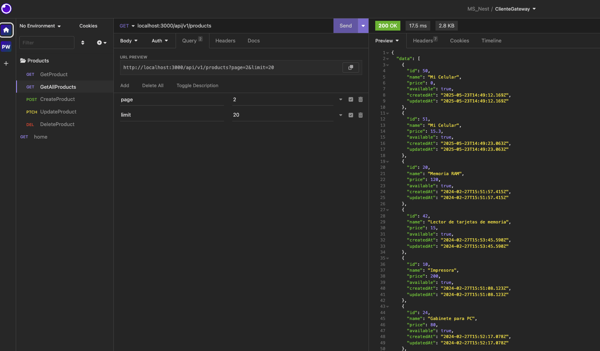

<p align="center">
  <a href="http://nestjs.com/" target="blank"></a>
</p>


# Cliente para acceder a los MS


1. Clonar repo
2. Crear o actualizar variables de entorno en .env
3. Instalar dependencias
```bash
$ npm install
```
4. Correr el proyecto
```bash
$ npm run start:dev
```

## Consumir Servicios

Acceder por la url `http://localhost:3000/api/v1/`


> consumo

----------------------

----------------------
